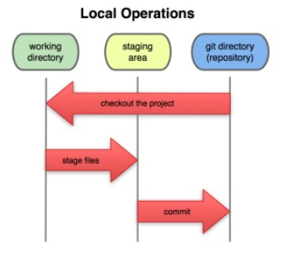

[Documento de referencia](https://docs.google.com/document/d/1ABxd-lB_nl1El3fF8dJDL7VeZpM6D3uAhK5I7QKKZuk/edit)
# Curso profesional de git y github
## Git y github
### Introducción a git
#### Qué es un sistema de control de versiones?
El SCV o VCS (version control system) es un sistema de control de versiones que registra los cambios realizados sobre un archivo o conjunto de archivos a lo largo del tiempo, de modo que puedas llevar el historial del ciclo de vida de un proyecto entero a un estado anterior. Cualquier tipo de archivo que se encuentre en un ordenador puede ponerse bajo control de un SCV.
#### Qué es Git?
Git es un SCV distribuido, diseñado por Linus Torvalds, pensando en la eficiencia y la confiabilidad del mantenimiento de versiones de aplicaciones cuando éstas tienen un gran número de archivos de código fuente. Git está optimizado para guardar todos los cambios de forma atómica e incremental.
Se obtiene su mayor eficiencia con archivo de texto plano, ya que con archivos binarios no puede guardar solo los cambios, sino que debe volver a grabar el archivo completo ante cada modificación, por mínima que sea, lo que hace que incremente demasiado el tamaño del repositorio.      
      **Guardar archivos binarios en el repositorio de git es una mala práctica, solo debería guardarse archivos pequeños (como logos) que no sufran casi modificaciones durante la vida del proyecto. Los binarios deben guardarse en un CDN.**

#### Qué es Github?
Es una plataforma de desarrollo colaborativo (forja) para alojar proyectos utilizando el SCV de git. Se utiliza principalmente para la creación de código fuente de programas de computadora.
Github puede considerarse como la red social de código para los programadores y en muchos casos es visto como tu currículum vitae.
### Comandos y conceptos básicos de git.
#### Las tres secciones principales de un proyecto git:
- El directorio de git (git Directory, Repository)
- El directorio de trabajo (Working Directory)
- El área de preparación (Staging Area)
#### Staging Area y git Directory
Al ejecutar el comando 'git init' (comando para iniciar un repositorio git) ocurren dos cosas:
- Se crea una carpeta .git el cual es el repositorio local donde git almacena los metadatos y la base de datos de objetos para el proyecto. Es la parte más importante de git, y es lo que se copia cuando clonas un repositorio desde otro ordenador.
- Se crea un archivo sencillo que define el staging area, generalmente está contenido en el directorio de git, que almacena información acerca de lo que va a ir en tu próxima confirmación.
#### Ciclo básico de trabajo en git
- Se modifica una serie de archivos en el directorio de trabajo.
- Se preparan los archivos añadiéndolos al área de preparación o staging area (git add).
- Se confirman los cambios: las instantáneas de los archivos que están en el área de stanging area se almacenan de forma permanente en el directorio de git (git commit).

#### Estado de un archivo
**Commited**: si una versión concreta de un archivo está en el directorio de git, se considera confirmada.
**Staged**: si ha sufrido cambios desde que se obtuvo del repositorio, pero ha sido añadida al área de preparación, está preparada.
**Modified**: y si ha sufrido cambios desde que se obtuvo del repositorio, pero no se ha preparado, está modificada.
#### ¿Qué es un branch y cómo funciona un merge en git?
Todos los commits se aplican sobre una rama. Por convención se empieza a trabajar en la rama master (puede cambiarse el nombre de ser necesario) y se crean nuevas a partir de esta, para crear flujos de trabajo independientes.
Crear una nueva rama implica copiar un commit (de cualquier rama), pasarlo a otro lado (a otra rama) y continuar el trabajo de una parte específica de nuestro proyecto sin afectar el flujo de trabajo principal (que continua en la rama main).
> **Estandar o buenas prácticas:**
> - Todo lo que esté en la rama 'main' va a producción.
> - Las nuevas features y experimentos se realizan en una rama 'development' que se unen a master cuando estén listas.
> - Los issues o errores se solucionan en una rama 'hotfix' para unirse a 'main' tan pronto como sea posible.

Se pueden crear todas las ramas y commits que ser requieran para mantener ordenado el proyecto. Incluso puede aprovechar el registro de cambios de git para crear ramas, traer versiones viejas del código, arreglarlas y combinarlas de nuevo para mejorar el proyecto.
Se debe tener en cuenta al combinar los conflictos que puedan generarse. Git siempre intentará unir los cambios automáticamente, pero no siempre funciona bien, eventualmente se deben resolver los conflictos a mano.
#### Comandos básicos
##### Crear repositorios y commits
- *git init*: inicializa un repositorio de git en la carpeta donde se ejecute el comando.
- *git add*: añade los archivos especificados al área de preparación (staging).
- *git commit -m 'descripción del commit'*: confirma los archivos que se encuentran en el área de preparación y los agrega al repositorio.
- *git commit -am 'descripción del commit'*: añade al staging area y hace un commit mediante un solo comando. (No funciona con archivos nuevos).
- *git status*: ofrece una descripción del estado de los archivos (untracked, ready to commit, nothing to commit).
- *git rm (. -r, filename) (--cached)*: remueve los archivos del index.
- *git config --global user.email <tu@email.com>*: configura un email.
- *git config --global user.name <Nombre como se verá en los commits>*: configura un nombre.
- *git config --list*: lista las configuraciones.
##### Analizar cambios en los archivos de un proyecto git
- *git log*: lista de manera descendente los commits realizados.
- *git log --stat*: además de listar los commits, muestra la cantidad de bytes añadidos y eliminados en cada uno de los archivos modificados.
- *git log --all --graph --decorate --oneline*: muestra de manera comprimida toda la historia del repositorio de manera gráfica y embellecida.
- *git show filename*: permite ver la historia de los cambios de una archivo.
- *git diff < commit1 > < commit2 >*: compara diferencias entre los cambios confirmados.
##### Volver en el tiempo con branches y checkout
- *git reset < commit > --soft/hard*: regresa al commit especificado, eliminando todos los cambios que se hicieron después de ese commit.
- *git checkout < commit/branch > <filename>*: permite regresar al estado en el cual se realizó un commit o branch especificado, pero no elimina loque está en staging area.
- *git checkout --< filePath >*: desahcer cambios en un archivo estado modificado (que ni fue agregado a staging)